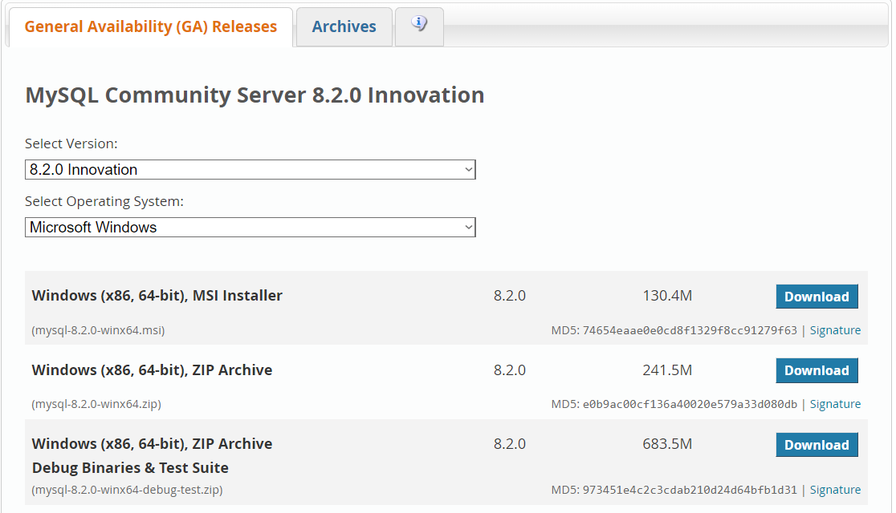

# The Database Applications For Tunes

The metadata associated with audio files in the MP3 format, commonly adhering to 
the [ID3 standard](https://id3lib.sourceforge.net/id3/id3v2com-00.html#sec4.15), has seen several iterations over the years and can be used to 
attribute up to 63 distinct informational fields. However, since the standard is 
not officially part of the MP3 format, many sources of audio tracks do not include 
ID3 tags, resulting in the task of categorizing falling on the shoulders of 
individuals compiling audio collections for personal or commercial use. 
This task, particularly the retrieval of the relevant information, becomes arduous 
even for a handful of files. We propose the development of a command-line tool for 
fetching a limited set of ID3 tags associated with a given user-provided query and 
returning the metadata in an easily parsable format.

## Setting Up Workflow/Toolchain

### Python

This project is written in the Python programming language and makes use of recent
(at the time of writing) language features, so Python 3.17 or newer is required. For
our recommended approach, please refer to the [dependencies](installing-dependencies) section below.

### MySQL Server

In order to run a local instance of the database, you need a Database Management software
package, for which we used [MySQL Server](https://dev.mysql.com/downloads/mysql/). 

After installing the correct version for your system, execute the installer. Once
the software has been installed, .

### MySQL Workbench

TODO

### Configure and Populate Database

TODO

## Installing Dependencies

TODO

## Usage

Begin by cloning the repository to your local machine.

### Running Command Line Interface Utility

TODO

### Graphical User Interface Guide

TODO

### Downloading DAFT and Installing Python:
  First, click the Code button and download the ZIP file from the GitHub page at: https://github.com/me11203sci/Database-Application-For-Tunes 
If Python isn’t already installed on your computer, the first step is to make that happen! Go to this link: https://www.python.org/downloads/release/python-3117/ and download the Windows installer for your system (Windows installer (64-bit) is recommended).
Open the installer and click “Install Now”
Python has been installed! Move on to the next step.

### Installing your MySQL database
  First, we will be downloading a MySQL Server, do so at the following link via the MSI Installer: https://dev.mysql.com/downloads/mysql/
Open the installer, click next until the Choose Setup Type screen, then select Typical, then Install. Once the download is finished, it will open the MySQL Configurator.
Once the configurator is open, keep selecting next until the Accounts and Roles screen is available. It will ask for a root password, pick a password and remember it. Continue clicking next, until you are prompted with Execute, which you will also click. Click Next, and then Finish. Your database is almost ready to go!

### Downloading MySQL Workbench
  To download MySQL Workbench, go to the following link and download via the MSI Installer: https://dev.mysql.com/downloads/workbench/ 
Open the MySQL Workbench Installer and click Next until you reach the Ready to Install the Program screen. Click Install. Once it is done, let it launch MySQL Workbench.
Once you’ve opened MySQL Workbench, if there is not already a MySQL Connection, click Rescan servers, and one should appear. Click on it. 
It should prompt you for a password, and you should enter the password you created in Step 2c. If, after clicking on your server, it instead takes a while to load and you are taken to a screen that says “Server Status: Stopped”, continue with step 3d, otherwise, move to Step 4.
First, open the Task Manager and go to the Services tab. If you do not see the Services tab, select More Details at the bottom. Once you’ve done this, scroll down until you see “MySQL##”. If it is stopped, right click it and select Start.
Once this is done, go back to your MySQL Workbench, select the home icon in the top left corner, and continue with Step 3c.

### Loading the premade tables and entries
  Now that you have MySQL Workbench open and connected to your local database, it might seem a bit empty, and that’s because it is. In order to populate this database, we need to import the premade schema. To do this, first go to the Administration tab located around the middle left of the screen.
Once here, select the Data Import/Restore option from the Management section.
This screen may seem to be complicated, but we don’t need to change much. The “Import from Dump Project Folder” option should already be selected, but we need to point it towards the right directory. Click the button labeled “…” at the end of that row, and browse for the folder labeled DatabaseDump that was downloaded at the beginning in the ZIP file.
Go to the Import Progress tab, and select Start Import from the bottom right corner. The tables and entries have been loaded!

### Python script setup
  Alright, homestretch, this is the last step of installation. First, navigate to the ZIP file you downloaded and open “.env”. Once here, type in the password you created back in Step 2c where it says “password=...”. Then, click File, and Save.
Once that’s done, go back to the daftDB ZIP file and run “dependencyInstallation.bat”. This script installs all the necessary dependencies that the DBMS relies on.
You’re ready to go! 

## User Guide

Thank you for downloading DAFT! This will be a user guide on how to manipulate your database of MP3s with the software.

## Guide

### Introduction to DAFT
### How to submit an MP3 to the database manually
### How to submit JSON files into the database
### How to edit a submission
### How to delete a submission
### How to append the tags of an entry to your MP3

#
## Introduction to DAFT

So, just what the heck does this software do anyways? DAFT stands for Database Application For Tunes, and it is a Database Management System that keeps track of all the tags on various songs so that if one were submitted to the software, it could have those tags appended to it. But what do I mean when I say tags? Tags, or more accurately, metadata, are pieces of information stored with an .mp3 file that provide information for it such as artist, album, title, and more. The de facto standard format for these tags among MP3s is called ID3, which stores the information about an mp3 as (usually) just a few bytes either at the beginning or the end of the file. This does not affect the audio content of an .mp3 file. DAFT supports the following ID3 tags: Title, Release Year, Genre, Artist, Album Track Number, and Album Art. So, if you’ve downloaded a song as an .mp3 file and aren’t sure of the release year, genre, title or really any of those main tags for it, you can submit it to DAFT. If that mp3 is in our system, you can quickly and easily add those tags on your .mp3 file to match.

## How to submit an MP3 to the database manually

In order to find the tags for an MP3, we need to submit it first. First, open the DAFT GUI (Graphical User Interface, the version that opens a window that you can interact with) version by running “startingDAFT.bat”, unless it is already open. From here, to submit a file, click the browse button in the first row, the one designated for “Choose an MP3 file” . Once you’ve located your .mp3 file, select Submit. From here, there are two possibilities:

If you see "The MP3 is already in our database":
Great! The information has been displayed for you.

If you see: "The MP3 is not yet in our database"
Unfortunately, we do not have this mp3 stored within the database yet. To help grow DAFT, please take the time to submit the information for the song to be stored if you would like to.

## How to submit JSON files into the database

If the idea of manually submitting hundreds or thousands of files to the database seems tedious to you, we had the same thought. So, to solve this, we’ve implemented a method that allows for a submission of multiple files to be added to the database. In order to do this, visit [github link] and follow instructions there. Once you have a folder with properly formatted JSON files, you can click the browse button in the second row, designated for uploading JSON files, and select all the files you’d like to upload. Once you have those, click Upload. The files that register as valid will then be automatically inserted into the database!

## How to edit a submission

First, submit your mp3 by following the steps in the How to submit an MP3 to the database manually section. If the tags for your mp3 are not in the database, then there is no submission to edit. However, if your mp3 is already in the database, then click the “Edit Submission” button. The information that is currently attributed to that MP3 will be auto filled so as to make small changes to prior entries easier. Once you are satisfied with your changes, you can select “Submit Data”.

## How to delete a submission

First, submit your mp3 by following the steps in the How to submit an MP3 to the database manually section. If the tags for your mp3 are not in the database, then there is no submission to delete. However, if your mp3 is already in the database, then all you need to do is click the “Delete Submission” button, and that submission will be deleted.

## How to append the tags of an entry to your MP3

Appending tags to your submitted MP3 can be done through the GUI (Graphical User Interface) version of DAFT, but it can also be done with the CLI (Command Line Interface) version. Let’s start with the GUI version. First, submit your mp3 by following the steps in the How to submit an MP3 to the database manually section. If the tags for your mp3 are not in the database, then we have no information for you to use. However, if your mp3 is already in the database, then all you need to do is click the “Append Tags To Submitted MP3” button, and your MP3 will have those tags appended to it. For the CLI version, this is a bit more complex, and we recommend the GUI version for those who don’t know their way around a terminal. If you do however, first navigate to the directory that the DAFT_CLI.py file is in, and type the command: “python daft_cli.py [INSERT MP3 FILEPATH HERE], replace the text and brackets with the filepath to the mp3 of your choice. Hitting enter will automatically append the tags to your mp3!

